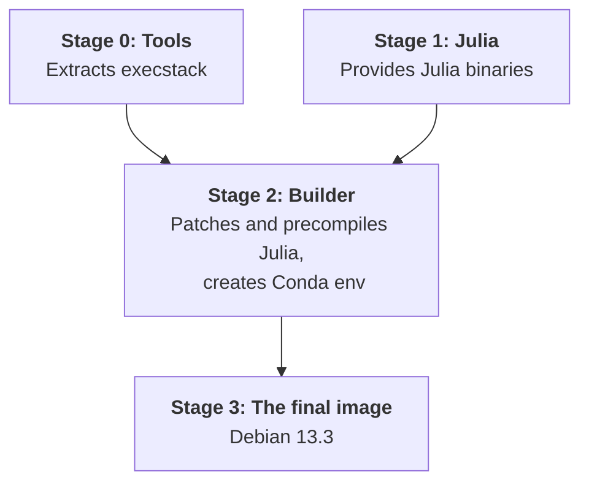

# Julia-Conda Hybrid Environment
This repository attempts to provide an efficient, multi-stage Docker environment for Julia 1.11.0 integrated with Miniconda3.

  
  &nbsp;&nbsp;
  

## Build Architecture

The build process is divided into four stages to manage tools and dependencies while keeping the final image size manageable.

